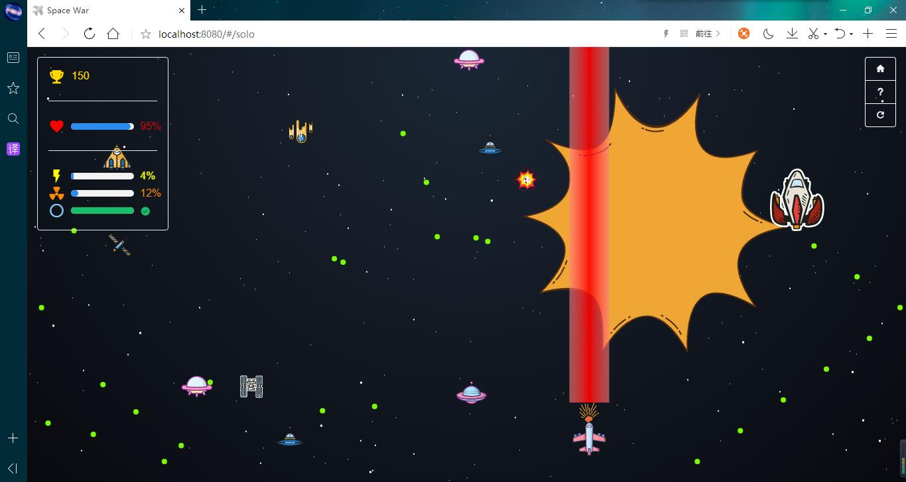
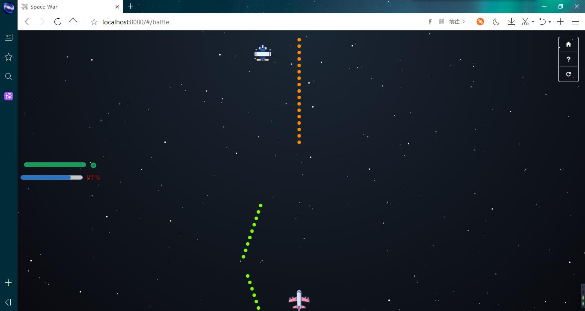

# SpaceWar-Web

## 简介

准备用Vue.js重构一下github.io，但是太久没碰Vue.js，于是决定先练练手找回感觉。

---
## 游戏-主页

- 点击底部footer可以跳转到该游戏github工程

---
## 游戏-单人挑战模式

- 进入该页面时会有游戏规则提示

- 左上角是状态，从上往下依次为分数，HP，激光炮CD，核弹CD，防护罩CD
- 右上角是菜单，从上往下依次为主页，帮助，重新开始
- 激光炮：对正前方路径上的敌人以及天体造成较高伤害
- 核弹：威力巨大，敌我不分，可遥控爆炸
- 防护罩：无敌，尽情装逼
- 敌人：普通飞船和boss飞船（看体积就能区分）
- 天体：障碍物，可以打爆得分
- 在HP耗光前尽可能获得更多的分数

---
## 游戏-双人对战模式

- 左侧是血槽，上下分别为玩家2和玩家1的
- 右上角是菜单，同单人模式
- 飞船只有普通攻击
- 打爆对方获胜

---
## 体验

[SpaceWar online]()
